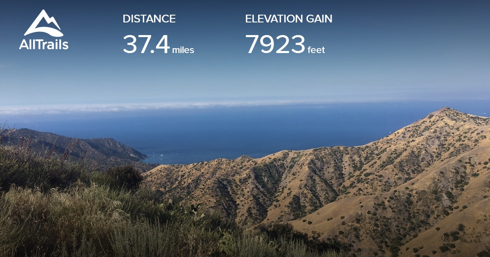
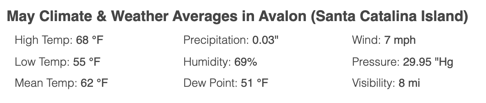
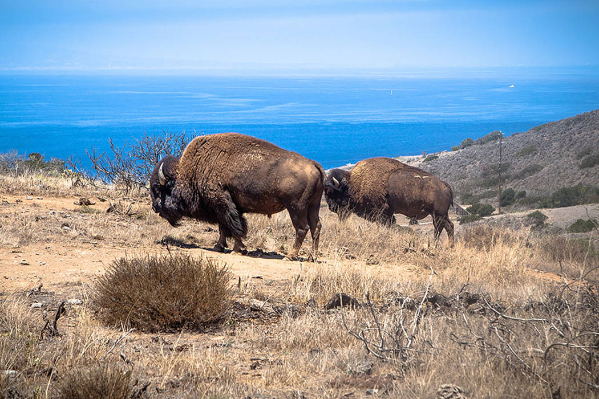

# catalina

Traverses Santa Catalina Island off the coast of southern California. From the eastern terminus at The Trailhead in Avalon out to Parson's Landing on the West end, then looping back to Two Harbors.

## Dates

Flexible but looking at four days in mid-May.

## Route 

| Day | Dest| Miles (total) | Miles (day) | Elevation (feet)| Est time (hours)| Water (miles) |
|-----|--------------------|---------------|-------------|-----------|----------|-------|
| 0   | Hermit Gulch       | 1.7| 1.7| 279| 0.7| Any|
| 1   | Black Jack         | 10.8| 9.1| 2,710| 4.4| 4|
| 2   | Two Harbors        | 25.1| 14.3| 2,431| 6.0| 2,8|
| 3.1 | Parson's landing   |32.3 |7.2 |1,929 | 3.4| None|
| 3.2 | Starlight day trip |41.4 |9.1 |1,821 | 3.9| None|
|   4 | Two Harbors        |49 |7.6 |745 | 2.9| None|

## Food planning

| Day | Dest             | Breakfast | Lunch | Snack | Dinner |
|-----|------------------|-----------|-------|-------|--------|
| 0   | Hermit Gulch     | Home      | Town  | Town  | Town   |
| 1   | Black Jack       | Town      | Town  | x     | x      |
| 2   | Two Harbors      | x         | x     | x     | Town   |
| 3   | Parson's landing | Town      | x     | x     | x      |
| 4   | Two Harbors      | x         | x     | x     | Town   |

## Getting there.

We will have to take a ferry to Avalon. Ferry services are operated by [CATALINA EXPRESS or CATALINA FLYER](https://www.lovecatalina.com/island-info/get-here/passenger-ferry/). From the ferry terminal it is about a 2 mile walk to the official Trailhead.

## Permits and Restrictions

Permits are required but available for free. Use https://www.catalinaconservancy.org/community/ for more information.

## Weather

## Amenities

The trans-catalina trail is not exactly wilderness backpackpacking. There are two towns on the route with shops, showers, and restaurants. Campsites will look more like established car camping sites than dispersed camping and while Parson's Landing may be a dry camp lockers with bottled water are available.  

## Critters

Bison will be the star of the show but there's a handy list of critters [here](https://www.catalinaconservancy.org/index.php?s=wildlife&p=animal_species).

We'll have to be aware of rattle snakes and be sure to protect our camp from rodents.

