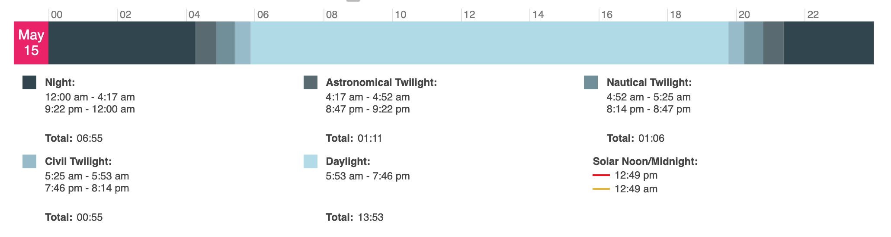

# catalina

Traverses Santa Catalina Island off the coast of southern California. From the eastern terminus at The Trailhead in Avalon out to Parson's Landing on the West end, then looping back to Two Harbors.

This will not be a wilderness trip.  It's more like touring some towns on foot.

There will be a day hike from Parson's to Starlight Beach (the "official end of the TCT") so we'll need day packs.

## Dates

Flexible but looking at four days in mid-May.

## Route 

| Day | Dest| Miles (total) | Miles (day) | Elevation (feet)| Est time (hours)| Water (miles) |
|-----|--------------------|---------------|-------------|-----------|----------|-------|
| 0   | Hermit Gulch       | 1.7| 1.7| 279| 0.7| Any|
| 1   | Black Jack         | 10.8| 9.1| 2,710| 4.4| 4|
| 2   | Two Harbors        | 25.1| 14.3| 2,431| 6.0| 2,8|
| 3.1 | Parson's landing   |32.3 |7.2 |1,929 | 3.4| None|
| 3.2 | Starlight day trip |41.4 |9.1 |1,821 | 3.9| None|
|   4 | Two Harbors        |49 |7.6 |745 | 2.9| None|

### Day 0:

Get to Longbeach for the 2:00 ferry to Avalon.  Go to Chet's hardware for fuel canisters.  Hang out in Avalon before making our way to Hermit Gulch Campsite.  Backtrack to The Sandtrap for dinner.

### Day 1:
Spend some more time in Avalon for the morning, breaking for Black Jack after an early lunch.

### Day 2:

Light breakfast and head for the airport about 2 miles for breakfast (8:30-11:00).  Then on to Two Harbors.  Dinner at Harbor Reef Bar and Grill (4-7).

### Day 3:

Breakfast and resuply at the General Store (9-3) before heading to Parson's Landing.  We'll make camp there before packing up a daypack and making a trip to Starlight Beach and back.  (Or delay the daytrip for day 4)

### Day 4:

Go to Starlight Beach if we didn't on day 3.  Back to Parson's before on to Two Harbors again. Then 4:45 p.m. ferry to San Pedro.  Then a 10 minute rideshare back to Longbeach.

## Food planning

| Day | Dest             | Breakfast | Lunch | Snack | Dinner |
|-----|------------------|-----------|-------|-------|--------|
| 0   | Hermit Gulch     | Home      | Town  | Town  | Town   |
| 1   | Black Jack       | Town      | Town  | x     | x      |
| 2   | Two Harbors      | x/airport | x     | x     | Town   |
| 3   | Parson's landing | Town      | x     | x     | x      |
| 4   | Two Harbors      | x         | x     | x     | Town   |

## Getting there.

We will have to take a ferry to Avalon. Ferry services are operated by [CATALINA EXPRESS or CATALINA FLYER](https://www.lovecatalina.com/island-info/get-here/passenger-ferry/). From the ferry terminal it is about a 2 mile walk to the official Trailhead.

## Permits and Restrictions

Permits are required but available for free. Use https://www.catalinaconservancy.org/community/ for more information.

## Weather

## Amenities

The trans-catalina trail is not exactly wilderness backpackpacking. There are two towns on the route with shops, showers, and restaurants. Campsites will look more like established car camping sites than dispersed camping and while Parson's Landing may be a dry camp lockers with bottled water are available.  

## Critters

Bison will be the star of the show but there's a handy list of critters [here](https://www.catalinaconservancy.org/index.php?s=wildlife&p=animal_species).

We'll have to be aware of rattle snakes and be sure to protect our camp from rodents.

